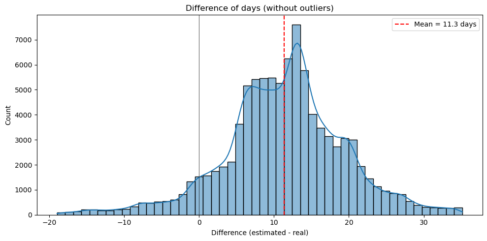
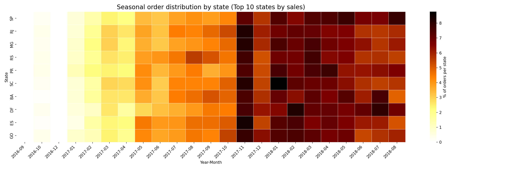

# E-Commerce Performance Analysis: Logistics Strategy & Seasonal Sales Impact

Statistical investigation of the Brazilian Olist e-commerce dataset (2016–2018) using SQL and Python, focused on two business hypotheses: the real impact of Black Friday on sales volume, and whether stores deliberately inflate shipping deadlines.

---

## Business questions

**1. Does Black Friday actually matter, statistically?**
Everyone assumes November is special for e-commerce. But is the sales spike a genuine or just part of the platform's natural growth trend? This project separates the two.

**2. Do stores deliberately over-promise on delivery times?**
Long estimated shipping windows protect customer satisfaction but may hurt checkout conversion. Is the 11-day buffer a deliberate strategy or poor calibration?

---

## Key findings

| Hypothesis | Result | Evidence |
|---|---|---|
| Black Friday drives significantly more orders | ✅ Supported | β = +2,535 orders, p = 0.005 |
| Stores systematically overestimate delivery times | ✅ Supported | Mean gap = 11 days, p < 0.00001 |

**Black Friday lift:** Controlling for the platform's organic monthly growth (~335 new orders/month), November alone generates an average of **~2,535 additional orders**, a statistically significant spike isolated from the baseline trend (Adjusted R² = 0.90).

**Logistics buffer:** Deliveries arrive, on average, **11 days earlier** than the estimated date. The distribution is heavily right-skewed, ruling out random miscalibration. This is a deliberate "Under-Promise, Over-Deliver" strategy with a real trade-off: it protects NPS but risks lowering front-end conversion rates.

---

## Methodology

### Data architecture
The Olist dataset contains ~100k orders across multiple Brazilian marketplaces. Analysis required joining five tables via `order_id`, `product_id`, and `customer_id` using SQLite through pandas.

### Statistical models

**Hypothesis 1 — OLS Linear Regression with dummy variable:**

$$\text{sales} = \beta_0 + \beta_1 t + \beta_2 \text{is\\_november} + \epsilon$$

The time trend variable `t` controls for organic growth; `is_november` isolates the Black Friday effect. A significant positive β₂ rejects H₀.

**Hypothesis 2 — Right-tailed One-Sample t-Test:**

$$\text{days\\_diff} = \text{Estimated Delivery} - \text{Actual Delivery}$$

Tests whether the population mean of `days_diff` is significantly greater than zero. The large sample size ensures robustness via the Central Limit Theorem.

### Exploratory analysis
Before hypothesis testing, the project mapped:
- Top 10 products by revenue, sales volume, and average ticket
- Top 10 categories by aggregate revenue and revenue share
- Seasonal order distribution across the top 10 Brazilian states (heatmap)

The heatmap revealed the November spike visually — motivating the formal regression test.

---

## Tech stack

| Tool | Purpose |
|---|---|
| `SQLite` via `pandas` | Data extraction and multi-table aggregation |
| `pandas` | Feature engineering, pivot tables, data transformation |
| `statsmodels` | OLS linear regression |
| `scipy.stats` | One-sample t-test |
| `seaborn` / `matplotlib` | Heatmap and distribution visualizations |

---

## Strategic takeaways

For an e-commerce platform in the Brazilian market:

- **Infrastructure planning:** Black Friday is statistically proven to demand ~2,500 extra orders beyond the already rising monthly trend. Supply chain, inventory, and server capacity must be scaled specifically for November.
- **Conversion optimization opportunity:** The 11-day buffer opens a concrete strategic question: could reducing the displayed shipping estimate by even 3–5 days boost checkout conversion without meaningfully increasing delivery risk?

---

## Limitations

- Dataset covers 2016–2018; findings reflect a specific historical moment in Brazilian e-commerce. The absolute Black Friday coefficient (~2,535 orders) should not be extrapolated directly to current platform volumes.
- The OLS model assumes linear organic growth. Non-linear growth dynamics (e.g., exponential scaling) are not captured.

---

## Dataset

[Brazilian E-Commerce Public Dataset by Olist](https://www.kaggle.com/datasets/olistbr/brazilian-ecommerce) — available on Kaggle.

---

*Business logic, SQL architecture, and statistical methodology are of my complete independent authorship. AI tools were used strictly as a productivity assistant for code refactoring and documentation translation.*
